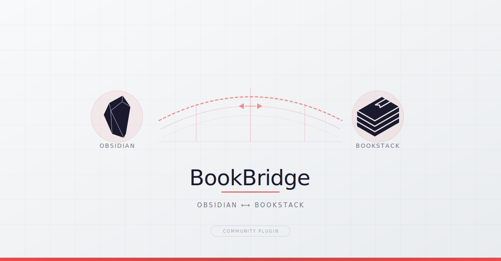

<p align="center">
  
</p>

# BookBridge

Obsidian community plugin for bidirectional sync between an Obsidian vault and a [BookStack](https://www.bookstackapp.com/) instance.

## Features

- **Pull Sync** — Download BookStack pages as Markdown into your vault
- **Push Sync** — Push local changes back to BookStack
- **Bidirectional Sync** — Automatically detect changes on both sides
- **Conflict Resolution** — Side-by-side diff view with manual resolution (Local/Remote/Skip)
- **Delete Sync** — Detect deleted pages and sync after user confirmation
- **Asset Download** — Save images and attachments locally, auto-rewrite URLs
- **HTML→Markdown Conversion** — BookStack callouts, code blocks, tables, internal links
- **Chapter Navigation** — Auto-generated index files and prev/next links
- **Image Upload** — Push local images to BookStack with de-duplication
- **Book Selection** — Sync individual or all books
- **Auto-Sync** — Optional automatic sync at a configurable interval

## Installation

### From GitHub Release

1. Go to the [latest release](https://github.com/rotecodefraktion/bookbridge/releases/latest)
2. Download `main.js`, `manifest.json` and `styles.css`
3. Create the folder `{vault}/.obsidian/plugins/bookbridge/`
4. Copy the three files into that folder
5. Restart Obsidian and enable the plugin under *Settings → Community Plugins*

### Manual

1. Create the folder `{vault}/.obsidian/plugins/bookbridge/`
2. Copy `main.js`, `manifest.json` and `styles.css` into that folder
3. Enable the plugin in Obsidian under *Settings → Community Plugins*

### Build from Source

```bash
git clone https://github.com/rotecodefraktion/bookbridge.git
cd bookbridge
npm install
npm run build
```

Then copy `main.js`, `manifest.json` and `styles.css` into your plugin folder.

## Configuration

1. Open plugin settings under *Settings → BookBridge*
2. Enter your **BookStack URL** (e.g. `https://books.example.com`)
3. Create an API token in BookStack under *Settings → API Tokens*
4. Enter **Token ID** and **Token Secret**
5. Click **Test** to verify the connection
6. Optional: Click **Load Books** to configure book selection

### Settings

| Setting | Default | Description |
|---------|---------|-------------|
| BookStack URL | — | Base URL of your BookStack instance |
| API Token ID / Secret | — | BookStack API token |
| Sync Folder | `BookStack` | Vault folder for synced content |
| Sync Mode | Bidirectional | Pull only, Push only, or Bidirectional |
| Conflict Strategy | Ask | Ask (show diff), Local wins, Remote wins |
| Download Assets | On | Download images and attachments locally |
| Asset Folder | `Attachments` | Subfolder for downloaded assets |
| Auto Sync | Off | Automatic sync |
| Auto Sync Interval | 30 min | Interval between automatic syncs |
| Book Selection | All | Choose which books to sync |

## Usage

### Commands

| Command | Description |
|---------|-------------|
| **Sync with BookStack** | Bidirectional sync of all selected books |
| **Pull from BookStack** | Download only (BookStack → Obsidian) |
| **Push to BookStack** | Upload only (Obsidian → BookStack) |
| **Sync Book...** | Bidirectional sync of a single book (fuzzy search) |
| **Pull Book...** | Download a single book (fuzzy search) |
| **Push Book...** | Upload a single book (fuzzy search) |

You can also trigger a sync via the **Ribbon Icon** (book icon in the sidebar).

### Vault Structure

```
BookStack/
├── Attachments/
│   ├── gallery/          # Images
│   └── attachments/      # PDFs and other attachments
├── Book A/
│   ├── _index.md         # Book overview with links to chapters
│   ├── Page 1.md
│   └── Chapter X/
│       ├── _index.md     # Chapter overview with links to pages
│       └── Page 2.md
└── Book B/
    ├── _index.md
    └── Page 3.md
```

### Frontmatter

Every synced file automatically receives frontmatter metadata:

```yaml
---
bookstack_id: 42
bookstack_type: page
bookstack_updated_at: "2026-04-03T10:00:00Z"
bookstack_book_id: 5
bookstack_chapter_id: 12
---
```

### Navigation

Every synced page includes a navigation line linking to the parent chapter/book and prev/next pages:

```
↑ [[Chapter/_index|Chapter Name]] · ← [[Previous Page]] · → [[Next Page]]
```

Index files (`_index.md`) are generated for each book and chapter, providing a table of contents with wikilinks to all pages.

### Conflicts

When a page has been changed both locally and in BookStack:

- **Ask** (default): A modal shows both versions side by side. You decide: *Keep Local*, *Keep Remote*, or *Skip*.
- **Local wins**: The local version is automatically pushed to BookStack.
- **Remote wins**: The BookStack version overwrites the local file.

For multiple simultaneous conflicts, a batch modal appears with per-file options.

### Deletions

Deleted pages are detected and presented to the user for confirmation — nothing is ever deleted automatically. Options per file:

- **Delete** — Delete on the other side as well
- **Keep (unlink)** — Keep the file/page but remove it from sync
- **Skip** — Do nothing

## Conversion

### BookStack → Obsidian (HTML → Markdown)

- BookStack callouts (`info`, `warning`, `danger`, `success`) → Obsidian callouts (`> [!info]`)
- Code blocks with syntax highlighting are preserved
- Internal BookStack links → Obsidian `[[Wikilinks]]` (if target page is synced)
- BookStack drawings → Placeholder with link to original
- Tables with colspan/rowspan → Markdown table with warning comment
- GFM: Tables, strikethrough, task lists

### Obsidian → BookStack (Markdown → HTML)

- Full Markdown support via `marked` library (tables, footnotes, nested lists, etc.)
- Obsidian callouts → BookStack callout classes
- Wikilinks → BookStack internal links
- Local images → BookStack Image Gallery URLs
- Image upload — local images are uploaded to BookStack Image Gallery, with de-duplication

## Development

```bash
npm run dev        # esbuild watch mode
npm run build      # Production build
npm run test       # Vitest
npm run lint       # ESLint
```

## License

Apache License 2.0 — see [LICENSE](LICENSE) and [NOTICE](NOTICE).
